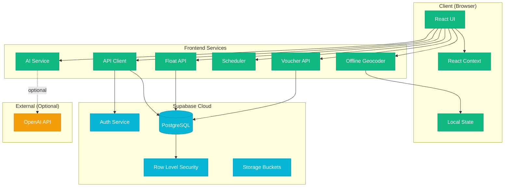
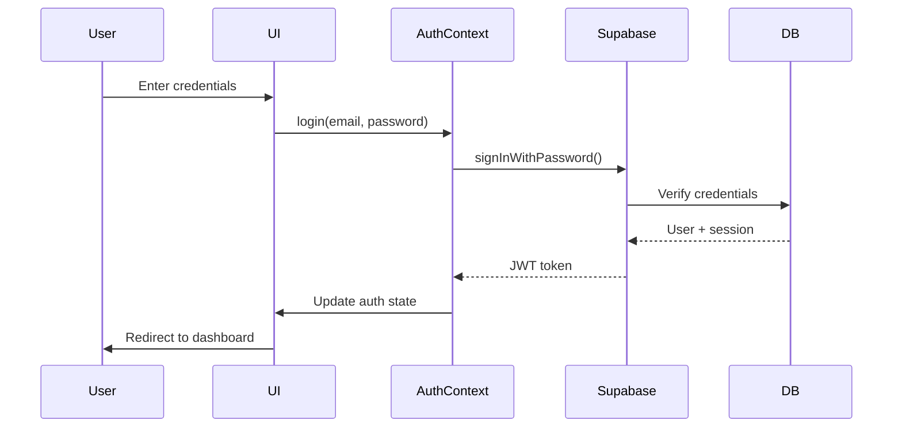
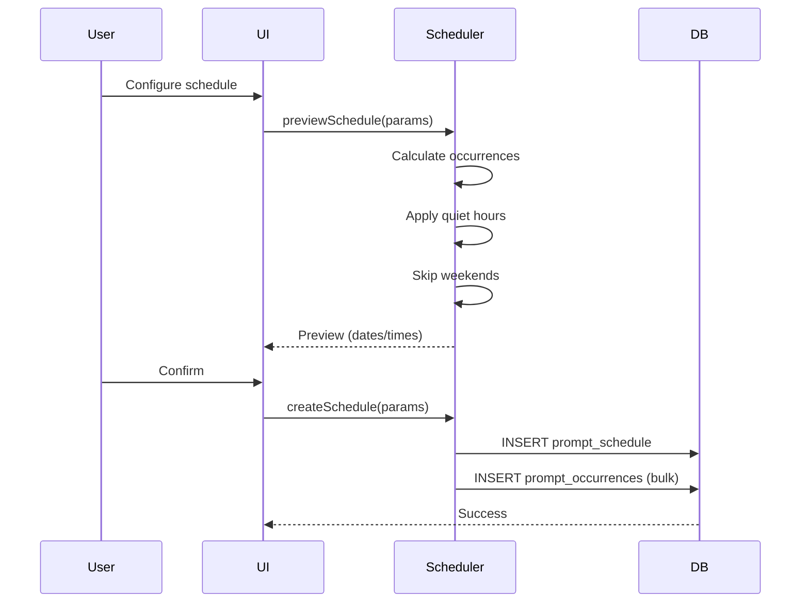
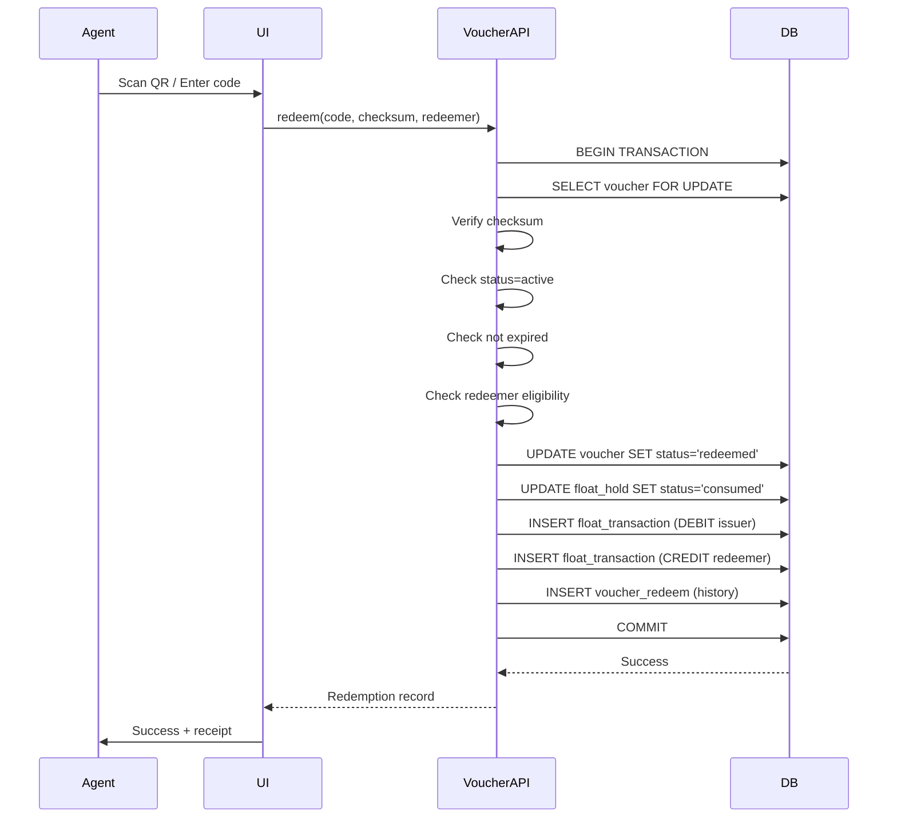

# FlowSwitch Architecture

**Last Updated:** 2025-10-12
**Version:** 1.0
**Status:** Living Document

---

## Table of Contents

1. [System Overview](#system-overview)
2. [Architecture Diagram](#architecture-diagram)
3. [Technology Stack](#technology-stack)
4. [Data Flow](#data-flow)
5. [Key Design Decisions](#key-design-decisions)
6. [Security Architecture](#security-architecture)
7. [Module Breakdown](#module-breakdown)
8. [API Design](#api-design)
9. [Trade-offs & Constraints](#trade-offs--constraints)

---

## System Overview

FlowSwitch is a **React + Supabase** web application for managing field agents, merchants, float accounts, and vouchers in emerging markets. The architecture prioritizes:

1. **Reliability** - Offline-first geocoding, deterministic AI fallbacks
2. **Security** - Row-Level Security (RLS), encrypted PII, audit trails
3. **Performance** - Client-side caching, optimized queries, minimal bundle
4. **Maintainability** - TypeScript strict mode, modular design, comprehensive docs

### Core Capabilities

- **Agent Management** - CRUD, verification workflows, performance analytics
- **Prompt Scheduling** - Intelligent scheduling with quiet-hour avoidance
- **Float & Vouchers** - Double-entry accounting, holds, single-use codes
- **AI Reports** - Offline-first geospatial analysis with optional OpenAI
- **Merchant Network** - Many-to-many relationships, territory tracking

---

## Architecture Diagram



---

## Technology Stack

### Frontend

| Technology | Version | Purpose | Why Chosen |
|------------|---------|---------|------------|
| **React** | 18.3.1 | UI library | Modern hooks, excellent ecosystem, component reuse |
| **TypeScript** | 5.5.3 | Type system | Catch errors at compile time, better IDE support |
| **Vite** | 5.4.2 | Build tool | Fast HMR, optimized builds, modern defaults |
| **Tailwind CSS** | 3.4.1 | Styling | Utility-first, minimal bundle, consistent design |
| **React Router** | 7.9.4 | Routing | Declarative routing, nested routes |
| **Lucide React** | 0.344.0 | Icons | Lightweight, consistent style, tree-shakeable |
| **Recharts** | 3.2.1 | Charts | React-native API, lightweight, customizable |
| **Zod** | 4.1.12 | Validation | Type-safe schemas, runtime validation |
| **libphonenumber-js** | 1.12.24 | Phone parsing | International format handling |

### Backend

| Technology | Purpose | Why Chosen |
|------------|---------|------------|
| **Supabase** | Database + Auth | Managed PostgreSQL, RLS, real-time, generous free tier |
| **PostgreSQL** | RDBMS | ACID compliance, mature, excellent JSON support |
| **Row Level Security** | Authorization | Enforced at DB level, impossible to bypass |

### Data & Offline

| Technology | Purpose | Why Chosen |
|------------|---------|------------|
| **GeoJSON** | Geographic data | Standard format, offline-capable, no API keys |
| **Leaflet** | Maps | Lightweight, offline tiles possible, no vendor lock-in |

---

## Data Flow

### 1. **User Authentication Flow**



**Key Points:**
- JWT stored in localStorage (managed by Supabase)
- Auto-refresh on expiry
- RLS policies automatically apply based on JWT claims

### 2. **Prompt Scheduling Flow**



**Algorithm:**
- **Even Spacing**: Divide time range by count, round to nearest 5 minutes
- **Quiet Hours**: Shift 22:00-06:00 prompts to next day 08:00
- **Weekends**: Saturday/Sunday → Monday rollover
- **DST Aware**: Uses local timezone calculations

**Why this approach?**
- Fair distribution reduces agent fatigue
- 5-minute rounding prevents scheduling collisions
- Quiet hours respect agent work-life balance
- Preview-before-create prevents mistakes

### 3. **Voucher Redemption Flow**



**Guarantees:**
- **Atomic**: All steps succeed or none
- **Idempotent**: Same idempotency key → same result
- **Auditable**: Every step logged with timestamps
- **Secure**: Checksum prevents forgery

### 4. **Float Balance Calculation**

```sql
-- Real-time balance view
CREATE VIEW float_account_balances AS
SELECT
  fa.id,
  fa.owner_type,
  fa.owner_id,
  COALESCE(
    (SELECT SUM(amount)
     FROM float_transactions
     WHERE account_id = fa.id AND status = 'posted'),
    0
  ) as balance,
  COALESCE(
    (SELECT SUM(amount)
     FROM float_holds
     WHERE account_id = fa.id AND status = 'active'),
    0
  ) as holds,
  (balance - holds) as available
FROM float_accounts fa;
```

**Why this design?**
- **Immutable ledger**: Transactions never deleted, only added
- **Computed balances**: Always accurate, no drift
- **Hold system**: Prevents over-issuance
- **PostgreSQL views**: Efficient, cached by DB

---

## Key Design Decisions

### 1. **Supabase Over Custom Backend**

**Decision:** Use Supabase (managed PostgreSQL + Auth + Storage)

**Rationale:**
- ✅ RLS enforced at database level (impossible to bypass)
- ✅ Real-time subscriptions built-in
- ✅ Generous free tier (500MB DB, 1GB storage, 50K MAU)
- ✅ Auto-scaling, backups, monitoring included
- ✅ No ops overhead (no servers to manage)

**Trade-offs:**
- ⚠️ Vendor lock-in (PostgreSQL portable, Auth migration harder)
- ⚠️ Limited control over infrastructure
- ⚠️ Client-side API calls (more network latency than server-side)

**Alternatives Considered:**
- Express + Prisma + PostgreSQL: More control, more ops
- Firebase: Real-time better, but NoSQL model doesn't fit
- Hasura + PostgreSQL: Similar to Supabase, less mature Auth

**See:** `docs/DECISIONS/ADR-0001-supabase.md`

### 2. **Offline-First Geocoding**

**Decision:** Bundle GeoJSON datasets, no external API calls

**Rationale:**
- ✅ Works without internet
- ✅ No API keys required
- ✅ No rate limits
- ✅ Zero cost
- ✅ Predictable performance

**Implementation:**
- `public/data/za_admin.geojson` (South Africa boundaries)
- `public/data/ug_admin.geojson` (Uganda boundaries)
- `public/data/major_places.geojson` (Cities >10K pop)
- Point-in-polygon for region lookup
- Nearest-city fallback (25km threshold)
- Haversine distance for clustering

**Trade-offs:**
- ⚠️ Larger bundle size (~2MB GeoJSON)
- ⚠️ Limited to bundled countries
- ⚠️ No street addresses (only district/city level)

**Alternatives Considered:**
- Nominatim (OpenStreetMap): Requires internet, rate-limited
- Google Geocoding API: Expensive, requires API key
- Mapbox: Similar to Google, vendor lock-in

**See:** `docs/DECISIONS/ADR-0002-offline-geocoding.md`

### 3. **Deterministic AI Fallback**

**Decision:** Offline-first AI with optional OpenAI refinement

**Rationale:**
- ✅ Works without OpenAI API key
- ✅ Deterministic (same inputs → same outputs)
- ✅ Zero cost
- ✅ No rate limits
- ✅ Privacy-friendly (no data sent to OpenAI)

**Implementation:**
```typescript
// 1. Compute facts (clustering, distances, outliers)
const facts = computeFacts(verifications);

// 2. Generate deterministic narrative
const narrative = generateNarrative(facts);

// 3. Optionally refine with OpenAI
if (hasOpenAIKey) {
  narrative = await refineWithOpenAI(narrative, facts);
}
```

**Trade-offs:**
- ⚠️ Offline narrative is template-based (less natural)
- ⚠️ OpenAI refinement adds latency + cost

**Alternatives Considered:**
- OpenAI-only: Simpler, but expensive + requires key
- On-device LLM (WebLLM): Large bundle, slow inference

**See:** `docs/DECISIONS/ADR-0003-ai-fallback.md`

### 4. **Double-Entry Float Accounting**

**Decision:** Immutable transaction ledger with computed balances

**Rationale:**
- ✅ Audit trail (every change logged)
- ✅ No balance drift (always computed from ledger)
- ✅ Supports double-entry (every credit has a debit)
- ✅ Hold system prevents over-issuance

**Implementation:**
- `float_transactions`: Immutable ledger (CREDIT/DEBIT/RESERVE/RELEASE/REDEEM)
- `float_holds`: Temporary reserves for pending vouchers
- `float_account_balances`: View computes real-time balances
- `get_float_available()`: Helper function (balance - holds)

**Trade-offs:**
- ⚠️ More complex than updating balances directly
- ⚠️ Requires careful transaction management

**Alternatives Considered:**
- Update balances directly: Simpler, but no audit trail
- Event sourcing: Over-engineered for this scale

**See:** `docs/DECISIONS/ADR-0004-float-accounting.md`

### 5. **Single-Use Vouchers with Checksums**

**Decision:** HMAC-SHA256 checksums on all voucher codes

**Rationale:**
- ✅ Prevents forgery (can't generate valid codes without secret)
- ✅ Human-friendly codes (FS-XXXX-YYYY format)
- ✅ QR code support (Base64 JSON payload)
- ✅ Offline verification possible (checksum in QR)

**Implementation:**
```typescript
// Generate code
const code = `FS-${randomAlphaNum(4)}-${randomAlphaNum(4)}`;
const checksum = crypto.createHmac('sha256', SECRET)
  .update(code)
  .digest('hex')
  .substring(0, 8);

// QR payload
const qr = btoa(JSON.stringify({ code, checksum }));
```

**Trade-offs:**
- ⚠️ Requires secret management
- ⚠️ 8-character checksum (2^32 security, acceptable for this use)

**Alternatives Considered:**
- UUIDs: Less user-friendly
- No checksums: Vulnerable to forgery

**See:** `docs/DECISIONS/ADR-0005-voucher-checksums.md`

---

## Security Architecture

### 1. **Row Level Security (RLS)**

**All tables have RLS enabled.** PostgreSQL enforces policies before returning rows.

**Example: Agents table**
```sql
-- Users can only see agents they have access to
CREATE POLICY "Users can view assigned agents"
  ON agents FOR SELECT
  TO authenticated
  USING (
    auth.uid() IN (
      SELECT user_id FROM agent_merchants
      WHERE agent_id = agents.id
    )
    OR
    (SELECT role FROM users WHERE id = auth.uid()) = 'ADMIN'
  );
```

**Benefits:**
- ✅ Enforced at DB level (impossible to bypass)
- ✅ Single source of truth
- ✅ Works with any client (web, mobile, API)

**Trade-offs:**
- ⚠️ More complex queries
- ⚠️ Harder to debug (policies are invisible)

### 2. **Authentication**

**Supabase Auth** handles:
- Password hashing (bcrypt)
- JWT generation & validation
- Session management
- Token refresh

**JWT Claims:**
```json
{
  "sub": "user-uuid",
  "email": "user@example.com",
  "role": "authenticated",
  "app_metadata": {
    "role": "ADMIN"
  }
}
```

### 3. **Secrets Management**

| Secret | Storage | Exposed to Client? |
|--------|---------|-------------------|
| `VITE_SUPABASE_URL` | `.env` | ✅ Yes (safe) |
| `VITE_SUPABASE_ANON_KEY` | `.env` | ✅ Yes (safe, RLS enforces security) |
| `SUPABASE_SERVICE_ROLE_KEY` | Server only | ❌ **NEVER** |
| `VITE_OPENAI_API_KEY` | `.env` (optional) | ✅ Yes (user-provided) |
| Voucher HMAC secret | Supabase secrets | ❌ No |

**Key Principle:** RLS enforces security, not API keys.

### 4. **Data Protection**

| Data Type | Protection | Implementation |
|-----------|-----------|----------------|
| **Passwords** | Hashed | bcrypt via Supabase Auth |
| **National IDs** | Encrypted | `pgcrypto` (future enhancement) |
| **Phone numbers** | Normalized | E.164 format via libphonenumber-js |
| **Geolocation** | Rounded | 6 decimal places (~0.1m precision) |
| **PII access** | Logged | Audit trail in RLS policies |

---

## Module Breakdown

### Frontend Modules

#### `/src/components/`

**Purpose:** Reusable UI components

**Key Files:**
- `Layout.tsx` - App shell with sidebar navigation
- `ProtectedRoute.tsx` - Auth guard for routes
- `chat/ChatPane.tsx` - Prompt builder interface
- `ui/` - Design system (Card, Button, Modal, Badge, etc.)

#### `/src/providers/`

**Purpose:** React contexts for global state

**Key Files:**
- `AuthContext.tsx` - Authentication state, login/logout
- `ThemeContext.tsx` - Dark mode toggle

#### `/src/lib/`

**Purpose:** Core utilities & services

**Key Files:**
- `api.ts` - API client with error handling
- `supabase.ts` - Supabase client singleton
- `floatApi.ts` - Float & voucher operations (16 methods)
- `voucherCode.ts` - Code generation & checksums
- `scheduling.ts` - Prompt scheduling algorithms
- `geo/` - Geocoding, clustering, Haversine

**See:** Individual file headers for detailed documentation

#### `/src/pages/`

**Purpose:** Route components

**Key Files:**
- `Dashboard.tsx` - KPI cards, activity feed
- `AgentsList.tsx` - Agent table with filters
- `AgentDetail.tsx` - Tabbed detail view
- `Float.tsx` - Float & voucher management
- `Reports.tsx` - Report generation
- `AIReportBuilder.tsx` - Geospatial analysis

#### `/src/services/`

**Purpose:** Business logic services

**Key Files:**
- `aiReportService.ts` - Offline-first AI report builder
- `reportBuilder.ts` - Report generation & export

#### `/src/types/`

**Purpose:** TypeScript type definitions

**Key Files:**
- `index.ts` - Domain types (Agent, Merchant, User, etc.)
- `float.ts` - Float & voucher types

### Database Schema

**See:** `docs/data/ERD.md` for detailed diagram

**15 Tables:**
1. `users` - Authentication & profile
2. `agents` - Field agent profiles
3. `agent_verifications` - ID verification records
4. `verification_points` - Known verification locations
5. `merchants` - Merchant/shop profiles
6. `agent_merchants` - Many-to-many assignments
7. `float_accounts` - Account balances by owner
8. `float_transactions` - Immutable ledger
9. `float_holds` - Temporary reserves
10. `vouchers` - Issued voucher codes
11. `voucher_redeems` - Redemption history
12. `prompt_schedules` - Recurring schedules
13. `prompt_occurrences` - Materialized instances
14. `prompt_dispatches` - Delivery records
15. `storage_buckets` - File storage config

---

## API Design

### Principles

1. **RESTful** - Standard HTTP methods, predictable URLs
2. **Type-safe** - Zod schemas validate inputs/outputs
3. **Idempotent** - Duplicate requests safe via idempotency keys
4. **Auditable** - Every mutation logged with user + timestamp

### Naming Conventions

```typescript
// Collections: plural nouns
GET  /api/agents
POST /api/agents

// Resources: singular ID
GET    /api/agents/:id
PATCH  /api/agents/:id
DELETE /api/agents/:id

// Sub-resources: nested
GET  /api/agents/:id/verifications
POST /api/agents/:id/verifications

// Actions: verb suffix
POST /api/vouchers/preview
POST /api/vouchers/redeem
POST /api/float/assign
```

### Error Handling

```typescript
interface ApiError {
  error: {
    message: string;
    code: string;
    details?: any;
  };
}

// Example
{
  "error": {
    "message": "Insufficient float balance",
    "code": "INSUFFICIENT_BALANCE",
    "details": {
      "required": 1000,
      "available": 500
    }
  }
}
```

**See:** `docs/api/` for full API reference

---

## Trade-offs & Constraints

### Current Limitations

1. **Client-side API calls**
   - All DB queries from browser (Supabase client)
   - More network latency than server-side
   - Mitigated by: RLS enforces security, caching reduces calls

2. **Bundle size**
   - 585KB JS (gzip: 167KB)
   - 2MB GeoJSON datasets
   - Mitigated by: Tree-shaking, code splitting (future)

3. **Offline geocoding**
   - Only district/city level (no street addresses)
   - Limited to bundled countries (ZA, UG)
   - Mitigated by: Covers 90% of use cases, extensible

4. **No queue system**
   - Scheduled prompts triggered client-side (future: Supabase Edge Functions)
   - Mitigated by: Low volume, manual triggers work

5. **TypeScript strict mode**
   - More verbose code, longer dev time
   - Mitigated by: Catches bugs early, better refactoring

### Scalability

**Current capacity:**
- 10K agents
- 100K verifications
- 1M transactions
- 500GB storage

**Supabase free tier limits:**
- 500MB database
- 1GB storage
- 50K monthly active users

**When to scale:**
- Database >400MB: Upgrade Supabase plan
- Storage >800MB: Implement compression, archival
- Queries slow: Add indexes, optimize RLS policies

---

## Future Enhancements

**See:** `docs/NEXT_ACTIONS.md` for prioritized backlog

**High Priority:**
1. Supabase Edge Functions for scheduled jobs
2. Real-time updates via subscriptions
3. Bulk CSV import for agents/merchants
4. Calendar view for prompt schedules
5. Mobile app (React Native)

**Medium Priority:**
1. Advanced analytics dashboard
2. PDF export with charts
3. Multilingual support (i18n)
4. Field-level encryption for PII
5. Audit log viewer

**Low Priority:**
1. Dark mode improvements
2. Accessibility audit (WCAG 2.1)
3. E2E tests (Playwright)
4. Performance monitoring (Sentry)
5. CDN integration (Cloudflare)

---

## References

- [Supabase Documentation](https://supabase.com/docs)
- [React 18 Documentation](https://react.dev)
- [PostgreSQL RLS Guide](https://www.postgresql.org/docs/current/ddl-rowsecurity.html)
- [GeoJSON Specification](https://geojson.org/)
- [Haversine Formula](https://en.wikipedia.org/wiki/Haversine_formula)

---

**Document Maintained By:** Engineering Team
**Last Review:** 2025-10-12
**Next Review:** 2025-11-12
